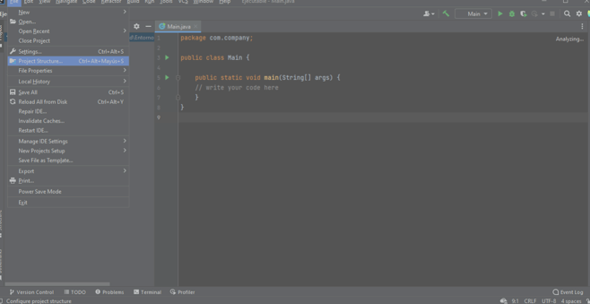
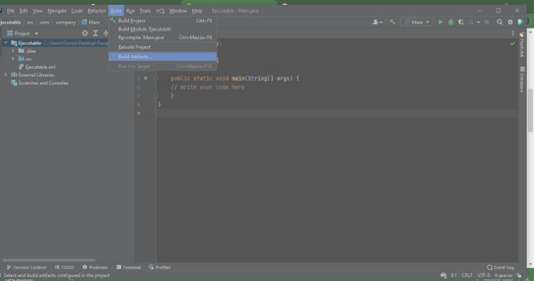
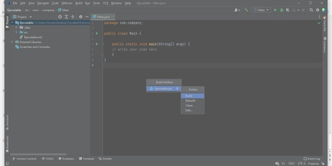
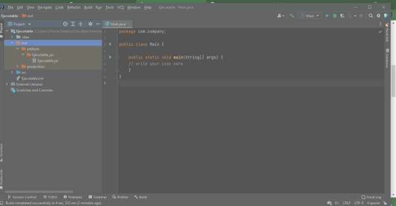

# _Tarea 6.3: Documentación_

Para esta tarea usare la tarea 4.2 en la cual se debia documentar como se genera un archivo ejecutable en un entorno de desarrollo

___

# _Tarea 4.2 Generar un archivo ejecutable_

### Alumno: Gonzalo Nahuel García de León
### Curso: 1ºDAM
### Profesor: Raúl Reyes Mangano

___

## Índice

* [ Diapositiva 3: Selección de un entorno de desarrollo.](#ide)
* [Diapositiva 4: Creación de un Proyecto.](#crear-un-proyecto-de-java)
* [Diapositiva 5: Agregando un codigo de prueba.](#creando-hello-world)
* [Diapositiva 6-9: Creación del archivo ejecutable.](#primer-paso)
* [Diapositiva 10: Archivo jar.](#archivo-jar)
* [Diapositiva 11: Webgrafia](#webgrafia)
---

## _IDE_

El primer paso que se debe tener en cuenta es la elección del entorno de desarrollo que se quiere utilizar en mi caso seria IntelliJ Idea.  


***
## _Crear un proyecto de java_

Se crea un proyecto nuevo en el IDE. 


***
## Creando un codigo de prueba.
**Una vez creado el proyecto, generamos un archivo Java con un codigo de prueba que devuelva un "Hola mundo" para probar que nuestro proyecto funciona**  
Ejecutamos el siguiente codigo:
```java
	public static void main(String[] args) {
        System.out.println("Hello, World!"); 
  }
```
***
## Primer Paso
Una vez creado el proyecto se tiene debe acceder al menú file y seleccionar Project structure.



---
## Segundo paso
Dentro del menú Project structure se selecciona en el menú.
 > **Project settings la opción de artifacts + Jar y por ultimo la opción from module with dependencies.** >

 

 ---   

 ## Tercer Paso

 Luego se debe seleccionar el menú build y la opción build artifacts.  

 

 ---

## Último paso

Por último en el menú build artifacts se selecciona la acción build.  



***

## Archivo jar

Luego de seleccionar la acción build se crea nuestro archivo ejecutable .jar.  



___

## Webgrafia

[Como crear un archivo jar en intellij
](https://platzi.com/tutoriales/1222-java-basico-2018/4706-como-crear-un-archivo-jar-en-intellij/
)


